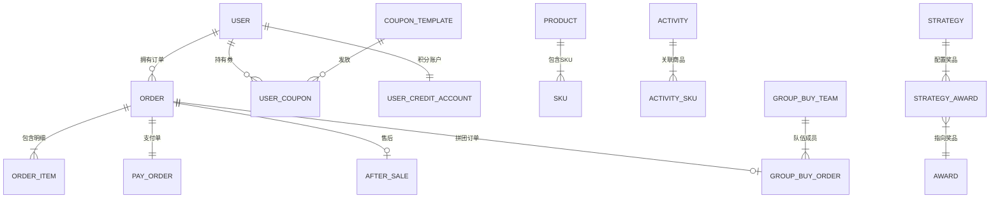
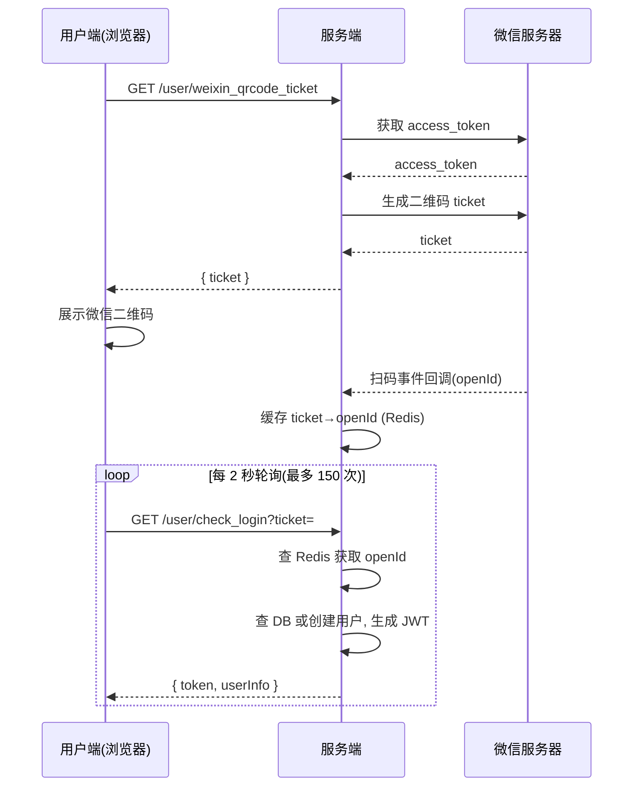
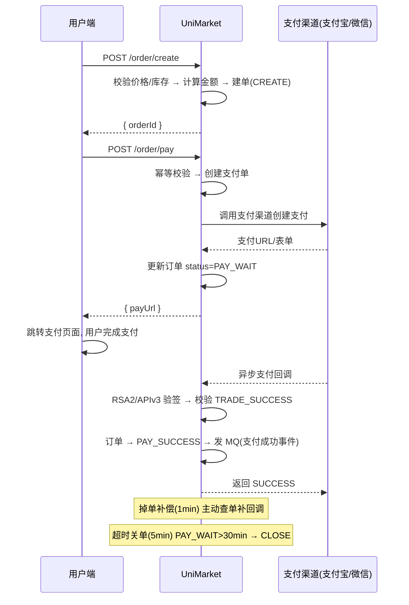
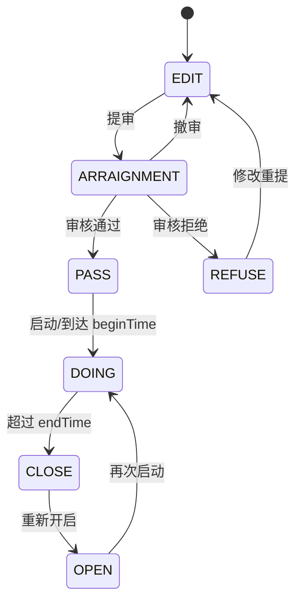
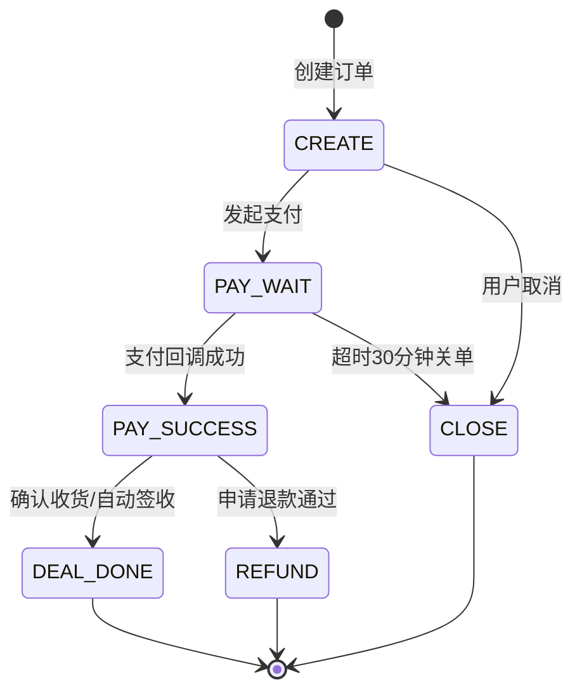

# 统一商城前台 — 系统设计文档（SDS）

> 基于《PRD-统一商城前台 v2.0》（2026-08-10）与《需求文档-SRS v1.0》编制的系统设计说明书。
> 版本：v1.0 ｜ 编制日期：2026-08-10 ｜ 状态：评审中

---

## 目录

1. [引言](#1-引言)
2. [设计原则与约束](#2-设计原则与约束)
3. [系统架构设计](#3-系统架构设计)
4. [模块划分](#4-模块划分)
5. [技术栈](#5-技术栈)
6. [领域模型设计](#6-领域模型设计)
7. [数据库设计](#7-数据库设计)
8. [API 接口设计](#8-api-接口设计)
9. [核心业务流程设计](#9-核心业务流程设计)
10. [关键技术方案](#10-关键技术方案)
11. [部署架构设计](#11-部署架构设计)
12. [设计决策记录（ADR）](#12-设计决策记录adr)

---

## 1. 引言

### 1.1 编写目的

本文档规定 UniMarket 的总体架构、模块划分、领域模型、数据库、接口、核心流程、关键技术方案与部署设计，指导开发实现。阅读对象：研发、测试、运维。

### 1.2 设计依据

- 《PRD-统一商城前台 v2.0》
- 《需求文档-SRS v1.0》
- 业界成熟电商方案的设计参考（支付/抽奖/营销/拼团）与自研实现

### 1.3 设计范围

覆盖 C 端商城全链路：登录、商品、搜索、购物车、下单、支付、优惠券、抽奖、拼团、积分、返利、售后、物流、首页运营、消息、ERP 运营后台、风控与监控。

---

## 2. 设计原则与约束

| 原则 | 说明 |
|------|------|
| DDD 六边形架构 | 领域层为核心，技术与外部依赖（DB/MQ/Redis/外部 API）通过端口-适配器隔离 |
| 先走通再优化 | 模块化单体起步，接口预留 RPC 边界，未来可平滑拆分为微服务 |
| 复用优先 | 参考业界成熟方案已覆盖 60%+ 能力，迁移设计思路而非重写 |
| 最终一致性 | 跨模块写操作采用"本地消息表 + MQ + 定时补偿"三层保障 |
| 可运营 | 营销活动配置化，运营无需发版即可创建/上下线活动 |

**约束**：
- JDK 21、Spring Boot 3.4.x 生态
- MySQL 8.4 / Redis 7.2 / RocketMQ / Kafka / Nacos / XXL-Job 为基础中间件
- 一人全栈开发，周期 16 周

---

## 3. 系统架构设计

### 3.1 总体架构（DDD 六边形）

```
                      ┌──────────────────────────────┐
                      │         Trigger 触发器层       │
                      │  HTTP Controller / MQ Listener │
                      │   RPC Facade / XXL-Job        │
                      └──────────────┬───────────────┘
                                     │
                      ┌──────────────▼───────────────┐
                      │        Application 应用层      │
                      │    流程编排 / AOP / 事件处理    │
                      └──────────────┬───────────────┘
                                     │
          ┌──────────────────────────┼──────────────────────────┐
          │                          │                          │
  ┌───────▼───────┐          ┌───────▼───────┐          ┌───────▼───────┐
  │  Domain 领域层  │          │   Types 类型层  │          │    API 接口层  │
  │  核心业务逻辑    │          │  枚举/常量/异常   │          │  DTO / 接口契约 │
  └───────┬───────┘          └───────────────┘          └───────────────┘
          │
  ┌───────▼──────────────────────────────────────────────────────┐
  │                  Infrastructure 基础设施层                     │
  │  DAO / Repository / Redis / MQ / ES / Canal / 外部API适配器    │
  └──────────────────────────────────────────────────────────────┘
```

### 3.2 分层职责

| 层 | 职责 | 关键点 |
|----|------|--------|
| Trigger | 接收外部触发：HTTP、MQ、定时任务、第三方回调 | 只做参数校验与协议转换，不写业务逻辑 |
| Application | 流程编排、事务边界、事件发布、AOP 切面 | 组合领域服务，不承载领域规则 |
| Domain | 聚合根/实体/值对象、领域服务、仓储接口 | ★ 核心，业务规则唯一归属 |
| Types | 枚举、常量、通用异常、事件基类 | 无业务逻辑 |
| API | DTO、RPC 接口契约 | 供 Trigger 与未来 RPC 消费 |
| Infrastructure | DAO、仓储实现、缓存、MQ、ES、外部适配器 | 依赖倒置，可替换 |

### 3.3 领域全景图

```
┌─────────────────────────────────────────────────────────────────────────┐
│                         UniMarket 领域全景                               │
├─────────────────────────────────────────────────────────────────────────┤
│  ┌──────────┐    ┌──────────┐    ┌──────────┐    ┌──────────┐          │
│  │   用户    │    │   商品    │    │   订单    │    │   支付    │          │
│  │  Domain  │    │  Domain  │    │  Domain  │    │  Domain  │          │
│  │·微信登录  │    │·商品CRUD │    │·下单流程  │    │·支付渠道  │          │
│  │·Token管理│    │·SKU管理  │    │·订单状态机│    │  抽象     │          │
│  │·用户画像  │    │·分类管理  │    │·退款流程  │    │·回调验签  │          │
│  │·收货地址  │    │·库存管理  │    │·订单查询  │    │·对账补偿  │          │
│  └─────┬────┘    └─────┬────┘    └─────┬────┘    └─────┬────┘          │
│        │               │               │               │               │
│        └───────────────┼───────────────┼───────────────┘               │
│                        │               │                                │
│                ┌───────▼───────────────▼───────┐                        │
│                │          营销 Domain ★        │                        │
│                │  ┌─────────┐  ┌─────────────┐ │                        │
│                │  │ 抽奖引擎 │  │  拼团引擎    │ │                        │
│                │  │·概率算法 │  │·开团/参团   │ │                        │
│                │  │·规则链   │  │·锁单/结算   │ │                        │
│                │  │·决策树   │  │·退款策略    │ │                        │
│                │  │·奖品发放 │  │·成团回调    │ │                        │
│                │  └────┬────┘  └──────┬──────┘ │                        │
│                │  ┌────▼──────────────▼──────┐  │                        │
│                │  │       积分引擎           │  │                        │
│                │  │  ·积分账户              │  │                        │
│                │  │  ·行为返利(签到/支付)    │  │                        │
│                │  │  ·积分兑换(抽奖次数/SKU) │  │                        │
│                │  └─────────────────────────┘  │                        │
│                │  ┌─────────────────────────┐  │                        │
│                │  │       折扣引擎           │  │                        │
│                │  │  ·直减/满减/折扣/N元购   │  │                        │
│                │  │  ·优惠试算               │  │                        │
│                │  └─────────────────────────┘  │                        │
│                │  ┌─────────────────────────┐  │                        │
│                │  │       风控体系           │  │                        │
│                │  │  ·限流(用户/IP/接口)     │  │                        │
│                │  │  ·黑名单(自动/手动)      │  │                        │
│                │  │  ·熔断降级              │  │                        │
│                │  │  ·人群标签(定向/排除)    │  │                        │
│                │  └─────────────────────────┘  │                        │
│                └───────────────────────────────┘                        │
│  ┌──────────────────────────────────────────────────────────────────┐   │
│  │                        通知 Domain                                │   │
│  │  ·微信模板消息 ·系统内消息 ·拼团成团回调(HTTP/MQ) ·异步通知补偿    │   │
│  └──────────────────────────────────────────────────────────────────┘   │
└─────────────────────────────────────────────────────────────────────────┘
```

### 3.4 能力映射

| 能力域 | 对应实现 |
|--------|------------------|
| 登录 + 支付 | 用户登录模块 + 支付模块基础原型 |
| 抽奖 | 抽奖引擎核心 + 分库分表方案 + 规则引擎 |
| 积分/风控/监控 | 积分引擎 + 风控体系 + 监控体系 |
| 拼团/折扣 | 拼团引擎 + 折扣引擎 + 回调通知体系 |

---

## 4. 模块划分

Maven 多模块工程 `uni-market/`：

```
uni-market/
├── uni-market-api/                    # RPC/DTO 接口定义
│   └── src/main/java/cn/unimarket/api/
│       ├── dto/  request/  response/  service/   # RPC Service 接口
│
├── uni-market-types/                  # 通用类型
│   └── src/main/java/cn/unimarket/types/
│       ├── common/  enums/  exception/  event/
│
├── uni-market-domain/                 # 领域层 ★核心★
│   └── src/main/java/cn/unimarket/domain/
│       ├── user/                      # 用户领域（model/repository/service：auth/account）
│       ├── product/                   # 商品领域（model/repository/service）
│       ├── order/                     # 订单领域（model/repository/service：下单/支付/退款）
│       ├── marketing/                 # 营销领域 ★重点★
│       │   └── service/
│       │       ├── raffle/           #   抽奖引擎（algorithm/chain/tree）
│       │       ├── groupbuy/          #   拼团引擎（lock/settlement/refund）
│       │       ├── credit/            #   积分引擎
│       │       ├── rebate/            #   返利引擎
│       │       └── discount/          #   折扣引擎
│       └── payment/                   # 支付领域（model/repository/service：alipay/weixinpay）
│
├── uni-market-infrastructure/         # 基础设施层
│   └── src/main/java/cn/unimarket/infrastructure/
│       ├── dao/  po/                  # MyBatis Mapper + 持久化对象
│       ├── repository/                # 仓储实现（user/product/order/marketing/payment）
│       ├── gateway/                   # 外部适配器（weixin/alipay/notification）
│       ├── mq/                        # producer/consumer
│       ├── cache/                     # Redis 缓存服务
│       └── es/                        # Elasticsearch 查询
│
├── uni-market-trigger/                # 触发器层
│   └── src/main/java/cn/unimarket/trigger/
│       ├── http/                      # UserController/ProductController/OrderController/
│       │                              # RaffleController/GroupBuyController/CreditController
│       ├── rpc/  mq/  job/            # Dubbo Facade / MQ 监听 / XXL-Job
│       └── portal/                    # WeixinPortalController / AlipayNotifyController
│
├── uni-market-app/                    # 启动与配置（Application/config/aop）
└── docs/
    ├── sql/                           # 建库建表 SQL
    ├── docker/                        # Docker Compose
    └── PRD / SRS / SDS / 计划表        # 项目文档
```

**依赖方向**：app → trigger → (domain / infrastructure) → types；domain 仅依赖 types 与 api；infrastructure 实现 domain 的仓储接口（依赖倒置）。

---

## 5. 技术栈

> 2026-08 技术选型升级（见 ADR-10）：由原 Java 8 + Boot 2.7 栈升级为 JDK 21 + Boot 3 栈。

| 层面 | 技术 | 用途 |
|------|------|------|
| 基础框架 | Spring Boot 3.4.x（JDK 21，jakarta 命名空间） | 应用框架 |
| JDK | JDK 21（LTS） | 开发语言 |
| 构建 | Maven 3.9.x | 构建管理 |
| ORM | MyBatis-Plus 3.5.5+（`mybatis-plus-spring-boot3-starter`，内嵌 MyBatis） | 数据访问 |
| 数据库 | MySQL 8.4 LTS | 主存储（Phase 10 前单库，后期再分库分表） |
| 缓存 | Redis 7.2 + Redisson 3.27+ | 缓存、分布式锁、库存扣减 |
| 对象存储 | MinIO | 文件/图片存储（商品图、售后凭证） |
| 消息队列 | RocketMQ 5.x（业务线） + Kafka 3.7+（日志/埋点线） | 异步解耦（双 MQ） |
| RPC | Apache Dubbo 3.2+ | 服务间调用（预留边界） |
| 注册/配置 | Nacos | 服务发现 & 配置管理 & DCC 动态配置 |
| 搜索引擎 | Elasticsearch + Canal | 商品搜索 |
| 定时任务 | XXL-Job | 分布式任务调度 |
| 限流熔断 | Sentinel（可辅以 Guava RateLimiter） | 流量控制（风控四级） |
| 接口文档 | Knife4j 4.4+（OpenAPI3 + Swagger，jakarta 版） | API 文档与调试 |
| 监控 | Prometheus + Grafana | 系统监控 |
| 链路追踪 | Micrometer Tracing + Zipkin（可选 SkyWalking） | 可观测性 |
| 日志 | ELK（Logstash + ES + Kibana） | 日志收集分析 |
| 容器化 | Docker Compose（开发/演示）→ K8s（生产） | 环境部署 |
| 前端 | React / Vue SPA | 用户端（PRD 不限定） |

---

## 6. 领域模型设计

### 6.1 用户聚合（User）

```
User (聚合根)
├── userId / openId / unionId / nickname / avatar / phone
├── status: UserStatus            # 正常/冻结/注销
├── addresses: List<Address>      # 收货地址（值对象集合）
└── creditAccount: CreditAccount  # 积分账户
    ├── totalAmount / availableAmount / freezeAmount
```

### 6.2 订单聚合（Order）

```
Order (聚合根)
├── orderId / userId
├── orderType: OrderType          # NORMAL普通 / GROUP_BUY拼团 / CREDIT积分兑换
├── items: List<OrderItem>        # productId/skuId/quantity/originalPrice/actualPrice
├── totalAmount / discountAmount / payAmount
├── status: OrderStatus           # CREATE → PAY_WAIT → PAY_SUCCESS → DEAL_DONE / CLOSE / REFUND
├── payChannel / payTime / outTradeNo
├── activityId / teamId           # 关联营销活动与拼团队伍（可选）
```

### 6.3 营销活动聚合（MarketingActivity）

```
MarketingActivity (聚合根)
├── activityId / activityName / activityType    # 抽奖/拼团/秒杀
├── strategyId / discountId                     # 关联抽奖策略 / 拼团折扣
├── beginTime / endTime
├── status: ActivityStatus                      # EDIT→ARRAIGNMENT→PASS→DOING→CLOSE
├── skuList: List<ActivitySku>                  # 活动价 + 活动库存
└── limitConfig: LimitConfig
    ├── totalStock / userTakeLimit / userDayLimit / userMonthLimit
```

### 6.4 抽奖策略聚合（Strategy）

```
Strategy (聚合根)
├── strategyId / strategyMode    # 单项概率 / 总体概率
├── grantType: GrantType         # 即时/定时/人工
├── ruleModels: String           # 规则模型配置
├── awards: List<StrategyAward>  # awardId/awardRate/awardCount/awardSurplusCount/ruleModels
└── rules: List<StrategyRule>    # ruleModel（权重/黑名单）/ ruleValue
```

### 6.5 拼团聚合（GroupBuyTeam）

```
GroupBuyTeam (聚合根)
├── teamId / activityId / targetCount / completeCount / lockCount
├── status: TeamStatus           # 拼团中/已成团/已失败/含退单
├── validTime / expireTime / startTime / completeTime
├── notifyUrl: String            # 成团回调URL
├── orders: List<GroupBuyOrder>  # userId/orderId/status/outTradeNo/bizId(防重)
└── discount: DiscountConfig     # marketPlan(ZJ/MJ/ZK/N) / marketExpr / discountAmount
```

### 6.6 购物车模型（Cart，值对象）

```
Cart (值对象，归属用户聚合)
├── userId
├── items: List<CartItem>        # skuId/productId/name/image/price/quantity/selected/stock/addTime
└── totalSelectedAmount          # 实时计算

设计决策：
- 双层存储：Redis 热数据（TTL 30 天）+ MySQL 冷备份
- 未登录加购 key=cart:device:{deviceId} → 登录后合并
- 进购物车页实时校验库存与价格，标记失效商品
```

### 6.7 优惠券聚合（Coupon）

```
CouponTemplate (聚合根 — 券模板)
├── templateId / couponName
├── couponType: CouponType       # 满减/折扣/运费/商品券
├── thresholdAmount / discountAmount / discountRate / maxDiscountAmount
├── applicableScope / scopeValue # ALL / CATEGORY / PRODUCT
├── totalQuantity / receivedQuantity / usedQuantity / userLimit
├── validDays / startTime / endTime
├── status: TemplateStatus       # 草稿/已发布/已停用
└── obtainChannels: String       # ACTIVITY/SIGN/MANUAL/NEW_USER

UserCoupon (实体 — 用户券)
├── userCouponId / userId / templateId
├── status: CouponStatus         # UNUSED → LOCKED → USED / EXPIRED / REFUNDED
├── orderId / receiveTime / useTime / expireTime / source
```

### 6.8 售后聚合（AfterSale）

```
AfterSale (聚合根)
├── afterSaleId / orderId / userId
├── type: AfterSaleType          # 仅退款 / 退货退款
├── reason / description / evidenceImages / refundAmount
├── status: AfterSaleStatus      # 待审核→审核通过(待寄回)→寄回中→待收货→已完成 / 拒绝 / 取消
├── logistics: AfterSaleLogistics# 退货物流 company/trackingNo/shipTime
├── auditRemark
└── timeline: List<AfterSaleEvent>  # APPLY/AUDIT/SHIP/RECEIVE/REFUND/COMPLETE

关联操作（售后通过后自动触发）：
- 退款：原路退回 + 退积分 + 退券
- 退货退款：用户寄回 → 商家收货 → 再退款
```

### 6.9 物流实体（Logistics）

```
Logistics (实体，关联订单)
├── orderId / trackingNo / companyCode / companyName
├── status: LogisticsStatus      # 待发货/运输中/派送中/已签收/异常
├── traces: List<LogisticsTrace> # time/status/location
├── shipTime / signTime / updateTime

设计决策：
- 第三方（快递鸟/菜鸟）为主数据源，不做主存储
- 关键节点（发货/签收）回调/定时轮询写入本地
- 签收自动触发确认收货 → 订单 DEAL_DONE
```

### 6.10 领域服务清单

| 领域服务 | 职责 | 核心方法 |
|----------|------|----------|
| `UserAuthService` | 微信登录认证 | `getQrCodeTicket()` / `checkLogin()` / `loginByOpenId()` |
| `ProductQueryService` | 商品查询与搜索 | `queryProductList()` / `queryProductDetail()` / `searchProducts()` / `querySkuActivityProducts()` |
| `ProductSearchService` | ES 商品搜索 | `fullTextSearch()` / `filterByCategory()` / `filterByPrice()` / `sortBy()` |
| `CartService` | 购物车管理 | `addToCart()` / `updateQuantity()` / `removeItem()` / `mergeCart()` / `validateCart()` |
| `OrderService` | 订单管理 | `createOrder()` / `payCallback()` / `refundOrder()` / `cancelTimeoutOrder()` |
| `OrderFlowService` | 订单履约 | `confirmShip()` / `autoConfirmReceive()` / `completeOrder()` |
| `PaymentService` | 支付渠道抽象 | `createPayOrder()` / `unifiedCashier()` / `verifyNotify()` / `queryPayStatus()` |
| `CouponService` | 优惠券管理 | `issueCoupon()` / `receiveCoupon()` / `lockCoupon()` / `useCoupon()` / `refundCoupon()` |
| `CouponCalculateService` | 优惠计算 | `calculateBestCoupon(cart, userCoupons)` |
| `AfterSaleService` | 售后管理 | `applyRefund()` / `applyReturn()` / `auditAfterSale()` / `shipReturn()` / `confirmReturn()` |
| `LogisticsService` | 物流管理 | `queryTracking()` / `subscribeTracking()` / `handleTrackingCallback()` |
| `RaffleDrawService` | 抽奖执行 | `doDraw()` / `doQuantificationDraw()` |
| `RaffleAlgorithmService` | 抽奖算法 | `randomDraw(strategyId, excludeAwardIds)` |
| `RuleEngineService` | 规则引擎 | `processDecisionTree(treeId, matterMap)` |
| `GroupBuyService` | 拼团管理 | `lockOrder()` / `settlementOrder()` / `refundOrder()` |
| `GroupBuyTeamService` | 成团判断 | `tryCompleteTeam(teamId)` |
| `CreditService` | 积分管理 | `adjustCredit()` / `queryAccount()` / `payByCredit()` |
| `RebateService` | 行为返利 | `createRebateOrder(behaviorType)` / `executeRebate()` |
| `DiscountCalculateService` | 优惠计算 | `calculate(plan, expr, originalPrice)` |
| `HomePageService` | 首页配置 | `queryBanners()` / `queryChannels()` / `queryRecommendProducts()` |
| `NotificationService` | 通知发送 | `sendWeixinTemplateMessage()` / `sendInAppMessage()` / `notifyTeamSuccess()` |

---

## 7. 数据库设计

### 7.1 分库策略

```
uni_market (db00) — 公共配置库（不分片）
  ├── 商品相关: product, sku, category
  ├── 营销配置: marketing_activity, activity_sku, strategy, strategy_award,
  │            award, rule_tree, rule_tree_node, rule_tree_node_line, discount
  ├── 行为返利: daily_behavior_rebate
  ├── 人群标签: crowd_tags, crowd_tags_detail
  ├── 优惠券:   coupon_template
  ├── 物流:     logistics
  ├── 首页运营: home_banner, home_channel
  ├── 拼团:     group_buy_team
  └── 通知:     notify_task

uni_market_01 / uni_market_02 — 用户数据分库（按 userId 哈希，2×4 = 8 分片）
  ├── user / user_address / user_credit_account / user_credit_order
  ├── order / order_item / pay_order
  ├── raffle_order / user_award_record / raffle_activity_account
  ├── group_buy_order / user_behavior_rebate_order
  ├── cart_item / after_sale / user_coupon / user_message / mq_task
```

路由算法：`hash = userId.hashCode() ^ (hashCode >>> 16)`；`dbIdx = hash % 2`；`tbIdx = (hash / 2) % 4`。

### 7.2 核心表清单（节选 DDL 要点）

| 表 | 库 | 关键字段 | 索引/约束 |
|----|----|----------|-----------|
| `product` | db00 | product_id, name, category_id, original_price, status | uk_product_id, idx_category_status |
| `sku` | db00 | sku_id, product_id, sku_name, sku_attrs, price, stock | uk_sku_id, idx_product_id |
| `marketing_activity` | db00 | activity_id, type, strategy_id, discount_id, begin/end_time, status, tag_id | uk_activity_id, idx_status_time |
| `activity_sku` | db00 | activity_id, sku_id, activity_price, stock_count, stock_surplus_count | idx_activity_id, idx_sku_id |
| `strategy` | db00 | strategy_id, strategy_mode(1单项/2总体), grant_type, rule_models | uk_strategy_id |
| `strategy_award` | db00 | strategy_id, award_id, award_sort, award_count, award_surplus_count, award_rate | idx_strategy_id |
| `award` | db00 | award_id, award_type(1文字/2码/3券/4实物/5积分), award_content, award_config | uk_award_id |
| `rule_tree / _node / _node_line` | db00 | tree_id, node_id, node_type(1子叶/2果实), rule_key, 连线限定类型/值 | uk_tree_id, idx_tree_id |
| `discount` | db00 | discount_id, market_plan(ZJ/MJ/ZK/N), market_expr | uk_discount_id |
| `daily_behavior_rebate` | db00 | behavior_type(sign/pay/share), rebate_type(sku/integral), rebate_value | — |
| `crowd_tags / _detail` | db00 | tag_id, tag_name, tag_type; tag_id+user_id | uk_tag_id, idx_tag_user |
| `coupon_template` | db00 | template_id, coupon_type(MJ/ZK/FREIGHT/PRODUCT), threshold, discount_amount/rate, max_discount, scope, total/received/used_quantity, user_limit, valid_days, start/end_time, status, obtain_channels | uk_template_id |
| `logistics` | db00 | order_id, tracking_no, company_code, status, traces(JSON), ship/sign_time | uk_order_id, idx_tracking_no |
| `home_banner` | db00 | banner_id, title, image_url, link_type, link_value, sort_order, status | idx_status_sort |
| `home_channel` | db00 | channel_id, channel_name, channel_icon, link_type/value, sort_order, status | idx_status_sort |
| `group_buy_team` | db00 | team_id, activity_id, target_count, complete_count, lock_count, status, valid_time, expire_time, notify_url | uk_team_id, idx_status_expire |
| `notify_task` | db00 | team_id/order_id/activity_id, notify_category, notify_type, notify_status, notify_url, retry_count, uuid | idx_status |
| `user_000~_003` | db01/02 | user_id, open_id, union_id, nickname, avatar, phone, status | uk_user_id, uk_open_id |
| `order_000~_003` | db01/02 | order_id, user_id, order_type, activity_id, team_id, total/discount/pay_amount, pay_channel, status, pay_time | uk_order_id, idx_user_id, idx_team_id, idx_status_time |
| `order_item_000~_003` | db01/02 | order_id, product_id, sku_id, quantity, original_price, actual_price | idx_order_id |
| `pay_order_000~_003` | db01/02 | pay_id, order_id, user_id, pay_channel, out_trade_no, pay_amount, pay_url, status, pay_time, notify_time | uk_pay_id, idx_order_id, idx_out_trade_no |
| `user_credit_account_000~_003` | db01/02 | user_id, total_amount, available_amount, freeze_amount | uk_user_id |
| `user_credit_order_000~_003` | db01/02 | user_id, order_id, trade_type(FORWARD/REVERSE), trade_amount, trade_name, out_biz_no | uk_order_id, idx_user_id |
| `raffle_order_000~_003` | db01/02 | order_id, user_id, activity_id, strategy_id, take_id, award_id, award_type, grant_state, mq_state | uk_order_id, idx_mq_state |
| `raffle_activity_account_000~_003` | db01/02 | user_id, activity_id, total/day/month_count + surplus | uk_user_activity |
| `group_buy_order_000~_003` | db01/02 | user_id, team_id, order_id, activity_id, status, out_trade_no, biz_id(防重) | uk_order_id, uk_biz_id, idx_team_id |
| `cart_item_000~_003` | db01/02 | user_id, sku_id, product_id, quantity, selected | idx_user_id |
| `after_sale_000~_003` | db01/02 | after_sale_id, order_id, user_id, type, reason, refund_amount, status, logistics | uk_after_sale_id, idx_user_order, idx_status |
| `user_coupon_000~_003` | db01/02 | user_coupon_id, user_id, template_id, status, order_id, expire_time, source | uk_user_coupon_id, idx_user_status, idx_expire |
| `user_message_000~_003` | db01/02 | user_id, message_id, title, content, message_type, is_read | uk_message_id, idx_user_read |
| `mq_task_000~_003` | db01/02 | user_id, message_id, topic, message_body, state, retry_count | idx_state |

### 7.3 关键一致性设计

- **下单事务**：锁券（UNUSED→LOCKED）+ 冻结积分 + 扣库存（Redis INCR）+ 建订单/明细 同一 `@Transactional`。
- **积分防透支**：`UPDATE ... SET available_amount = available_amount + #{amount} WHERE user_id=? AND available_amount + #{amount} >= 0`。
- **库存精确扣减**：`UPDATE strategy_award SET award_surplus_count = award_surplus_count - 1 WHERE ... AND award_surplus_count > 0`，affectedRows=0 表示已空。
- **拼团防重**：`uk_biz_id (activityId_userId_count)`。
- **积分交易防重**：`out_biz_no` 唯一。
- **通知/消息最终一致**：业务事务内写本地消息表（notify_task/mq_task），事务提交后发 MQ，XXL-Job 每分钟扫描补偿。

### 7.4 核心 ER 图（Mermaid）



---

## 8. API 接口设计

> 基础路径：`/api/v1/`。鉴权：JWT Token（`Authorization: Bearer <token>`）。

### 8.1 模块路由总览

| 模块 | 路径前缀 | 说明 |
|------|----------|------|
| 用户 | `/user/` | 微信登录、用户信息 |
| 商品 | `/product/` | 商品查询 |
| 订单 | `/order/` | 下单、支付、查询 |
| 支付 | `/pay/` | 支付单创建、回调 |
| 抽奖 | `/raffle/` | 抽奖、奖品查询 |
| 拼团 | `/groupbuy/` | 开团、参团、查询 |
| 积分 | `/credit/` | 积分查询、积分兑换 |
| 返利 | `/rebate/` | 签到、行为返利 |
| 运营 | `/erp/` | 活动管理、数据查询 |

### 8.2 用户/商品/购物车/搜索

| 方法 | 路径 | 说明 |
|------|------|------|
| GET | `/user/weixin_qrcode_ticket` | 获取微信扫码登录 ticket |
| GET | `/user/check_login?ticket={ticket}` | 轮询检测登录状态 |
| GET | `/user/info` | 获取当前用户信息 |
| PUT | `/user/address` / GET `/user/addresses` | 新增/修改收货地址 / 列表 |
| GET | `/product/list` / `/product/detail?productId=` | 商品列表（分页+分类）/ 详情 |
| GET | `/product/activity_products?activityId=` | 活动关联商品列表 |
| GET | `/product/search` | ES 全文搜索+筛选+排序 |
| GET | `/product/search/hot_keywords` / `/product/search/suggest` | 热门词 / 自动补全 |
| POST | `/cart/add` / `/cart/update` / DELETE `/cart/remove/{skuId}` | 加购 / 改数量 / 移除 |
| GET | `/cart/list` | 购物车列表（实时校验） |
| POST | `/cart/select` / `/cart/clear` | 选中切换 / 清空失效 |

### 8.3 订单/优惠券/售后/物流/首页/消息

| 方法 | 路径 | 说明 |
|------|------|------|
| POST | `/order/preview` | 订单预览（券+积分试算） |
| POST | `/order/create` | 创建订单（批量/券/积分） |
| POST | `/order/pay` / `/order/cashier` | 发起支付 / 统一收银台 |
| GET | `/order/detail` / `/order/list` | 详情（含物流）/ 列表 |
| POST | `/order/cancel` / `/order/confirm_receive` / `/order/del_flag` | 取消 / 确认收货 / 逻辑删除 |
| POST | `/order/alipay_notify` / `/order/wxpay_notify` | 支付异步回调 |
| GET | `/coupon/available` / POST `/coupon/receive/{templateId}` | 可领券列表 / 领券 |
| GET | `/coupon/my` / POST `/coupon/calculate` / GET `/coupon/count` | 我的券 / 最优券计算 / 统计 |
| POST | `/aftersale/apply` / `/aftersale/cancel` | 申请售后 / 取消 |
| GET | `/aftersale/detail` / `/aftersale/list` | 详情 / 列表 |
| POST | `/aftersale/ship_return` | 提交退货物流 |
| GET | `/logistics/tracking?orderId=` | 物流轨迹 |
| GET | `/home/banners` / `/home/channels` / `/home/recommend` / `/home/activity_tab` | 首页配置 |
| GET | `/message/list` / `/message/unread_count` / PUT `/message/read/{id}` / `/message/read_all/{type}` | 消息中心 |

### 8.4 抽奖/拼团/积分/返利/ERP

| 方法 | 路径 | 说明 |
|------|------|------|
| POST | `/raffle/draw` / `/raffle/quantification_draw` | 抽奖 / 量化抽奖 |
| GET | `/raffle/strategy/armory` / `/raffle/activity/armory` | 策略/活动装配（预热） |
| POST | `/raffle/award_list` / `/raffle/user_award_records` / `/raffle/activity_account` | 奖品列表 / 中奖记录 / 账户次数 |
| POST | `/groupbuy/index` / `/groupbuy/lock_order` / `/groupbuy/settlement` / `/groupbuy/refund` | 首页 / 锁单 / 结算 / 退单 |
| GET | `/groupbuy/team_detail` / `/groupbuy/user_teams` | 队伍详情 / 我的拼团 |
| GET | `/credit/account` / POST `/credit/exchange` / POST `/credit/records` | 账户 / 兑换 / 流水 |
| POST | `/rebate/calendar_sign` / `/rebate/is_sign_today` / GET `/rebate/sign_records` | 签到 |
| POST | `/erp/activity/create` … `/erp/activity/close` | 活动 CRUD + 状态流转 |
| PUT | `/erp/strategy/update` / `/erp/discount/update` | 策略/折扣配置 |
| POST | `/erp/coupon_template/create` / PUT `/erp/coupon_template/publish` | 券模板 |
| POST | `/erp/banner/create` / PUT `/erp/channel/update` | 首页配置 |
| POST | `/erp/product/create` / PUT `/erp/product/shelve/{id}` | 商品管理 |
| POST | `/erp/order/ship` | 订单发货 |
| GET | `/erp/aftersale/list` / POST `/erp/aftersale/audit` / `/erp/aftersale/confirm_receive` | 售后处理 |
| GET | `/erp/data/activity_statistics` / `/erp/data/sales_dashboard` | 数据看板 |

---

## 9. 核心业务流程设计

### 9.1 微信扫码登录

```
用户端 (浏览器)                        服务端                          微信服务器
     │                                   │                               │
     ├─ GET /user/weixin_qrcode_ticket ──►│                               │
     │                                   ├─ 获取 access_token ───────────►│
     │                                   │◄── access_token ────────────────┤
     │                                   ├─ 生成二维码 ticket ────────────►│
     │                                   │◄── ticket ──────────────────────┤
     │◄── { ticket } ────────────────────┤                               │
     ├─ 展示微信二维码                    │                               │
     │   [用户扫码]                       │◄── 扫码事件回调 ────────────────┤
     │                                   ├─ 解析 openId                    │
     │                                   ├─ 缓存 ticket → openId (Redis)   │
     ├─ 轮询 GET /user/check_login ─────►│                               │
     │   ?ticket={ticket}               ├─ 查 Redis 获取 openId            │
     │                                   ├─ 查 DB 或创建用户                │
     │                                   ├─ 生成 JWT Token                 │
     │◄── { token, userInfo } ──────────┤                               │
```

关键点：ticket→openId 缓存 5 分钟；前端每 2 秒轮询，最多 150 次；轮询接口限流（同一 ticket 每 2 秒 1 次）。

#### 9.1.1 登录时序图（Mermaid）



### 9.2 普通下单 + 支付

```
用户端                    UniMarket                          支付渠道(支付宝)
  ├─ POST /order/create ─►│ 查询SKU校验价格库存 → 计算金额 → 创建订单(CREATE)
  │◄── { orderId } ───────┤
  ├─ POST /order/pay ────►│ 幂等校验 → 创建支付单 → 调用渠道 ─────────────►│
  │◄── { payUrl } ────────┤◄── 支付URL/表单 ─────────────────────────────┤
  ├─ [用户完成支付]         │◄── 异步回调 ─────────────────────────────────┤
  │                       ├─ RSA256 验签 → 校验 TRADE_SUCCESS
  │                       ├─ 订单 → PAY_SUCCESS → 发 MQ(支付成功事件) → 返回 SUCCESS
```

**掉单补偿**（每 1 分钟）：查 pay_order status=CREATE 且 >5 分钟 → 主动 queryPayStatus → 已支付补执行回调。
**超时关单**（每 5 分钟）：order status=PAY_WAIT 且 >30 分钟 → CLOSE，释放库存、退券、退积分。

#### 9.2.1 下单支付时序图（Mermaid）



### 9.3 购物车 → 下单全链路

```
加购(cart:userId Hash) → 购物车页(实时校验库存/价格/标记失效) → 选中结算
  → POST /coupon/calculate（最优券组合：满减选最大面额 / 折扣选最低+上限最高）
  → POST /order/preview（商品金额 - 优惠券 - 积分抵扣，校验价格变化）
  → POST /order/create（锁券 + 冻积分 + Redis扣库存 + 建单 @Transactional + 清购物车）
```

### 9.4 优惠券生命周期

```
运营建模板(DRAFT) → 发布(PUBLISHED)
  → 用户获取（手动领取/签到赠送/活动发放/新人自动发）→ user_coupon(UNUSED, expireTime)
  → 下单锁定(LOCKED, 与订单同事务) → 支付成功(USED) / 支付失败或取消(→UNUSED)
  → 订单退款 → REFUNDED(可再次使用)
  → 定时任务：expireTime < now → EXPIRED
```

### 9.5 售后流程

```
申请售后(仅退款/退货退款)
  ├─ 仅退款：商家审核通过 → 自动退款(原路) + 退券 + 退积分
  └─ 退货退款：审核通过(待寄回) → 用户寄回(SHIPPED) → 商家确认收货(RECEIVED)
               → 退款 + 退券 + 退积分 → COMPLETED
  拒绝 → 通知用户原因
```

### 9.6 抽奖全链路

```
抽奖请求 → 责任链(黑名单→权重→默认) → 决策树(RuleLock锁次数/RuleStock库存/RuleLuckAward兜底)
  → 概率算法(单项O(1)散列 / 总体动态重算) → 结果落库 + MQ发奖消息
  → 消费者按 awardType 分发（文字/兑换码/券/实物/积分）
  → MQ 失败 → XXL-Job 扫描 mq_state=2 重发
```

### 9.7 拼团全链路

```
开团/参团 → 锁单责任链(校验+防重bizId+Redis库存) → 支付 → 回调结算更新队伍进度
  → tryCompleteTeam: completeCount == targetCount → 成团(回调通知 HTTP/MQ)
  → 超时未成团 → 定时任务自动退款；退单三种策略(未支付/已支付未成团/已成团)
```

### 9.8 积分体系

```
获取：每日签到 +10 / 购物返利(消费%) / 活动赠送
  → 积分调整原子操作（防透支 UPDATE）
消费：兑换抽奖次数 / 兑换 SKU 商品（7 步事务+MQ：建单→插流水→扣账户→插返利单→MQ→消费更新→补偿）
```

### 9.9 活动生命周期状态机

```
EDIT →(提审) ARRAIGNMENT →(通过) PASS →(启动) DOING →(到期) CLOSE →(重开) OPEN
        (撤审→EDIT)          (拒绝→REFUSE)
定时任务：PASS 到 beginTime → DOING；DOING 超 endTime → CLOSE
```

#### 9.9.1 活动状态机（Mermaid）



#### 9.9.2 订单状态机（Mermaid）



---

## 10. 关键技术方案

### 10.1 抽奖算法

**单项概率（斐波那契散列 O(1)）**：将概率值按比例映射到 128 长度数组（如 20% 概率 → 前 26 格），`hash = (randVal × 0x61c88647) & (len-1)` 均匀散列定位奖品；命中排除列表则视为未中奖。

```java
// 概率散列表，长度 128；0x61c88647 为黄金分割比的无符号整型表示
int idx = (int) ((randVal * 0x61c88647L + 0x61c88647L) & (rateTuple.length - 1));
String awardId = rateTuple[idx];
if (excludeAwardIds.contains(awardId)) return null; // 未中奖
```

**总体概率（动态重算分母）**：过滤已抽空奖品后，以剩余奖品概率之和为新分母等比放大，保证必中奖；兜底第一个可用奖品。

**随机源**：`SecureRandom`，避免可预测性。

### 10.2 规则引擎（责任链 + 决策树）

```
抽奖请求 → 责任链：BlackListChain(黑名单→返积分) → RuleWeightChain(专属权重→切换权重表)
         → DefaultChain → 决策树引擎
决策树节点：
  - 子叶（rule_lock 锁次数 / rule_stock 库存检查）
  - 果实（奖品A / 中奖 / 兜底奖品 Fallback）
连线限定类型：= > < >= <= enum
```

实现：组合模式构建规则树，过滤逻辑以责任链组织；`RuleEngineService.processDecisionTree(treeId, matterMap)` 统一入口。

### 10.3 库存扣减三层保障

| 层级 | 机制 | 作用 |
|------|------|------|
| L1 Redis 原子扣减 | `incr("activity:stock:"+activityId)` 超总量回滚抛 NoStockException；`setNx` 活动过期自动释放锁 | 快速失败 |
| L2 DB 行锁 | `UPDATE strategy_award SET award_surplus_count=award_surplus_count-1 WHERE ... AND award_surplus_count>0`，affectedRows=0 即空 | 精确扣减 |
| L3 定时补偿 | XXL-Job 每 5 分钟对比 Redis 与 DB 库存，以 DB 为准修正 | 最终一致 |

### 10.4 分库分表路由（2×4 = 8 分片）

```java
public class DBRouterStrategy {
    private final int dbCount = 2, tbCount = 4;
    public void doRouter(String userId) {
        int hash = hash(userId);                       // 扰动函数减少碰撞
        int dbIdx = hash % dbCount;                    // 0 → db01, 1 → db02
        DBContextHolder.setDBKey(String.format("db%02d", dbIdx + 1));
        int tbIdx = (hash / dbCount) % tbCount;
        DBContextHolder.setTBKey(String.format("_%03d", tbIdx));
    }
    private int hash(String key) {                     // HashMap 扰动函数
        int h;
        return (key == null) ? 0 : (h = key.hashCode()) ^ (h >>> 16);
    }
}
```

实现要点：MyBatis 拦截器（或 AOP）在 DAO 执行前按 userId 设置库/表上下文，执行后清理；扩容路径 4×8。

### 10.5 风控四级防护

```
用户请求 → L1 限流(Guava RateLimiter 每用户 1 req/s，超限 429)
        → L2 黑名单(Redis Set 查询；24h 超 5 次限流自动拉黑)
        → L3 熔断(Sentinel，超时 150ms 熔断，10s 后半开尝试)
        → L4 DCC 降级开关(degradeSwitch=true → 返回兜底结果)
        → 正常业务处理
```

### 10.6 最终一致性三层保障

```
Layer 1 本地消息表：业务操作 + INSERT notify_task 在同一 @Transactional 内
Layer 2 MQ 异步投递：事务提交后发 MQ，消费者处理成功 → UPDATE 消息 SUCCESS
Layer 3 定时补偿：XXL-Job 每 1 分钟扫描 PENDING/RETRY，重试最多 3 次，仍失败 → FAIL 告警人工介入
```

### 10.7 动态配置（DCC）

- 基于 Zookeeper 或 Redis Pub-Sub 实现配置变更广播，无需重启切换开关。
- 用途：活动降级、限流阈值、切量比例、优惠计算开关。

### 10.8 搜索（Canal + ES）

- MySQL Binlog → Canal → ES 索引（商品/活动）；Phase 2 可先用 ES SDK 直写简化。
- 查询走 ES，商品详情/库存走 MySQL。

---

## 11. 部署架构设计

### 11.1 Docker 基础设施

```yaml
# docker-compose-infrastructure.yml（端口摘要）
mysql:8.0.32            # 3306，initdb 挂载 docs/sql
redis:6.2               # 6379，requirepass redis123
rabbitmq:3.12.9-management  # 5672/15672
nacos/nacos-server:v2.2.3   # 8848，standalone
elasticsearch:7.17.14   # 9200，single-node
canal/canal-server:v1.1.7   # 11111
xuxueli/xxl-job-admin:2.4.1 # 9090
prom/prometheus:v2.47.2     # 9090
grafana/grafana:10.2.0      # 3000
kibana:7.17.14              # 5601
```

### 11.2 应用部署拓扑

```
┌────────────────────────────────────────────┐
│              Nginx (80/443)                 │
│          前端SPA + API反向代理               │
└───────────────┬────────────────────────────┘
    ┌───────────┼───────────┐
    ▼           ▼           ▼
┌────────┐ ┌────────┐ ┌────────┐
│ App-1  │ │ App-2  │ │ App-N  │  Spring Boot 多实例 :8091~:809N
└───┬────┘ └───┬────┘ └───┬────┘  Nacos 注册, Dubbo RPC
    └──────────┼──────────┘
               │
    ┌──────────┼──────────┐
    ▼          ▼          ▼
┌────────┐ ┌──────┐ ┌─────────┐
│ MySQL  │ │Redis │ │RocketMQ │
│ (主从) │ │(哨兵)│ │(集群)   │
└────────┘ └──────┘ └─────────┘
```

### 11.3 环境规划

| 环境 | 用途 | 说明 |
|------|------|------|
| 本地开发 | 日常开发调试 | Docker Compose 一键起中间件 |
| 演示环境 | 联调/演示 | 单机 + 内网穿透（支付回调） |

---

## 12. 设计决策记录（ADR）

| # | 决策 | 理由 | 备选方案 |
|---|------|------|----------|
| ADR-01 | 选 RabbitMQ 而非 Kafka | 对延迟敏感业务（支付回调）更友好，路由更灵活；未来埋点量大可加 Kafka 双 MQ | Kafka |
| ADR-02 | 保留分库分表（2×4） | 拼团/抽奖参与记录量级可达亿级，userId 分片最自然；可扩容 4×8 | 单库单表 |
| ADR-03 | 模块化单体 + Dubbo 假拆分 | 一人可完成的完整系统；接口预留 RPC 边界，未来平滑拆微服务 | 真微服务 |
| ADR-04 | 前端不限定 | 推荐 React + Ant Design Pro 或 Vue3 + Element Plus；抽奖动画 Lottie/Canvas | — |
| ADR-05 | 购物车双层存储 | Redis 热数据（TTL 30 天）+ MySQL 冷备份 | 仅 Redis / 仅 MySQL |
| ADR-06 | 售后逆向用最终一致 | 退款+退券+退积分跨写，本地消息表+MQ 保障，不追求强一致 | 强一致分布式事务 |
| ADR-07 | 最优券计算先贪心 | 先取最大优惠单张券，后续优化为组合遍历 | 组合遍历 |
| ADR-08 | 支付渠道抽象 | 统一收银台 + 渠道接口，新增渠道只实现接口 | 渠道硬编码 |
| ADR-09 | 积分/券/折扣互斥矩阵 | `calculateFinalPrice()` 统一入口，规则见 SRS §互斥矩阵 | 分散各处计算 |

---

*设计文档 v1.0 — 2026-08-10，源自《PRD-统一商城前台 v2.0》与《需求文档-SRS v1.0》*